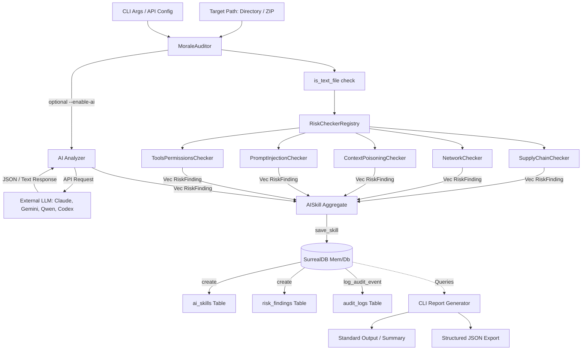

# Morale Skills Auditor - Data Flow Documentation

This document describes the flow of data within the Morale Skills Auditor tool, mapping the lifecycle of an audit from CLI inputs to checker execution, optional AI-assisted vulnerability analysis, SurrealDB persistence, and final reporting.

---

## High-Level Architecture Diagram

The diagram below highlights how data enters the system, is processed by various rule engines and external LLMs, saved into SurrealDB tables, and formatted into reports.



---

## Detailed Data Flows

### 1. Ingestion and Validation
* **Input Parameters:** The user runs `morale` via command-line flags. Inputs are parsed by `Args` (via `clap` in `src/main.rs`). Key inputs include `target_path`, options for verbose logging, format configurations (`--json`, `--summary`), and credential configurations (`--ai-api-key`, `--ai-service`, `--ai-endpoint`).
* **MoraleAuditor Initialization:** Instantiates an in-memory `Surreal<Db>` database.
* **Target Path Verification:** The path is checked to ensure it is a valid directory or a `.zip` archive. The file stem of the path defines the initial skill name.

### 2. Static Analysis Flow (The Risk Checkers)
When an audit is triggered, `RiskCheckerRegistry` (defined in `src/risk_checkers.rs`) executes several isolated risk checkers asynchronously:
1. **Supply Chain Check (`SupplyChainChecker`):** Scans file structures and file content for package manager configurations, looking for third-party libraries/dependencies, unpinned package versions, or suspicious package origins.
2. **Network Activity Check (`NetworkChecker`):** Scans content for hard-coded IP addresses, URLs, API endpoints, webhooks, or protocols (e.g., `http://`, `ftp://`) that might represent exfiltration risks.
3. **Context Poisoning Check (`ContextPoisoningChecker`):** Inspects prompt structures, system prompts, template files, and markdown inputs for instructions that attempt to load corrupted historical or conversational context.
4. **Prompt Injection Check (`PromptInjectionChecker`):** Scans for typical patterns of instructions designed to bypass system guidelines (e.g., "ignore all previous instructions", "you are now in developer mode", "DAN").
5. **Tools & Permissions Check (`ToolsPermissionsChecker`):** Scans skill/manifest files to verify if the model has excessive access to execute system tools, delete files, or read sensitive environmental configuration variables.

All checkers inspect text files discovered via `is_text_file` (from `src/risks/utils.rs`). Findings are accumulated into `Vec<RiskFinding>`.

### 3. AI-Assisted Analysis Flow (Optional)
If `--enable-ai` is set and credentials are provided, code snippets are extracted and dispatched to external LLMs for a semantic security review:
1. **Snippet Extraction:** Text files (size limited between `0` and `10,000` characters) are collected into memory.
2. **Dispatching:** Based on the `--ai-service` option, `AIAnalyzer` builds the corresponding payload and invokes the provider:
   - **Claude:** `https://api.anthropic.com/v1/complete`
   - **Gemini:** `https://generativelanguage.googleapis.com/v1beta/models/gemini-pro:generateContent`
   - **Codex / GPT-4:** `https://api.openai.com/v1/chat/completions`
   - **Qwen:** Invokes a custom endpoint provided in CLI flags.
3. **Response Parsing:**
   - If the API returns structured JSON containing fields such as `risk_type`, `severity`, `description`, and `evidence`, those are mapped directly to corresponding strongly typed fields.
   - If structured parsing fails, the entire response text is captured as standard `evidence` within a generic `RiskType::AIBased` finding.

---

## Database Schemas and Storage Flow

Once checkers complete, the aggregated `AISkill` and findings are serialized and written to SurrealDB.

```
                  ┌─────────────────────────────────┐
                  │          ai_skills              │
                  ├─────────────────────────────────┤
                  │ id: String (ID)                 │
                  │ name: String                    │
                  │ description: Option<String>     │
                  │ file_path: String               │
                  │ created_at: Option<DateTime>    │
                  │ status: String                  │
                  │ risks: Array (Embedded)         │──┐
                  └─────────────────────────────────┘  │
                                   ▲                   │ Referencing
                                   │                   │ Record IDs
                                   │                   ▼
                  ┌─────────────────────────────────┐
                  │        risk_findings            │
                  ├─────────────────────────────────┤
                  │ id: String (ID)                 │
                  │ skill_id: record<ai_skills>     │◄─┘
                  │ risk_type: String               │
                  │ severity: String                │
                  │ description: String             │
                  │ evidence: String                │
                  │ location: Option<String>        │
                  │ timestamp: DateTime             │
                  └─────────────────────────────────┘
                                   ▲
                                   │ Related By skill_id
                                   │
                  ┌─────────────────────────────────┐
                  │          audit_logs             │
                  ├─────────────────────────────────┤
                  │ id: String (ID)                 │
                  │ skill_id: record<ai_skills>     │◄─┘
                  │ action: String                  │
                  │ details: Object (JSON Value)    │
                  │ timestamp: DateTime             │
                  └─────────────────────────────────┘
```

### Table Definitions

* **`ai_skills` Table:**
  - `id`: Unique identifier (UUID string).
  - `name`: Name of the skill.
  - `description`: Optional text.
  - `file_path`: Absolute location of scanned files.
  - `created_at`: Datetime of the scan.
  - `status`: Default is `"pending"`.
  - `risks`: Embedded list of findings.

* **`risk_findings` Table:**
  - Written in parallel to `ai_skills` for easier querying.
  - Contains descriptive information such as `severity` (`Critical`, `High`, `Medium`, `Low`) and the file path `location`.
  - Linked to `ai_skills` via `skill_id`.

* **`audit_logs` Table:**
  - Captures historical events like `"skill_created"`, `"skill_updated"`, `"skill_deleted"`, and `"finding_added"`.
  - Linked to the affected skill via `skill_id`.

---

## Reporting & Output Flow

1. **Standard CLI Output:** Grouped by severity in descending order (`Critical` down to `Low`) with formatted titles, evidence, and code locations.
2. **Structured JSON Output:** Returns the full `AISkill` aggregate serialized as pretty-printed JSON.
3. **Database Exporters:**
   - **`export_all_data`:** Backs up the entire state (`ai_skills`, `risk_findings`, `audit_logs`) as a single JSON payload.
   - **`import_data`:** Restores state from a JSON backup, updating existing database records or inserting missing ones recursively.
